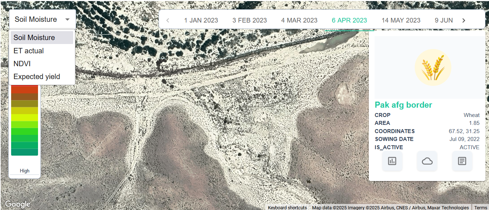
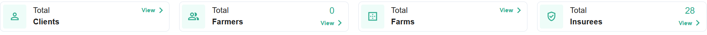

# Dev Portal

## Login

    1.  No notification upon wrong password.

## Monitoring

    2.  Fix view farm report , view farm weather , view farm insurance *see monitoring image below*
    3.  Fix NDVI , Soil Moisture , Expected Yield *see monitoring image below*
    4.  Fix Top Tabs *see tab image below*
    5.  Add User and By District Options.
    6.  Remove high to low, use 4 values as in infarmer app.
    7.  Fix by date values *see monitoring image below*

## Analysis

    8.  Text hidden or Overlapping.
    9.  API calls needed in Analytics.
    10.  API calls needed in Farms.
    11.  Download Report not working.

## Manage

    12. API calls needed.

## General

    1.  No loading screens.
    2.  Go to somewhere when clicked on top right logo.
    3.  new APIs needed at the backend.
    4.  Main Menu not working properly when back button is clicked.

*Monitoring Image*

*Top Tabs Image*
